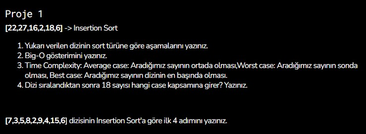

# Insertion Sort Project

`SORU`



`Cevap 1:`

* 
```
0. [22,27,16,2,18,6]
1. [22,27,16,2,18,6]
2. [16,22,27,2,18,6]
3. [2,16,22,27,18,6]
4. [2,16,18,22,27,6]
5. [2,6,16,18,22,27]
```

* Big O Notation = `O(n²)`

* 18 ortada bulunduğu için `"Average Case"`

`Cevap 2:`
```
0. [7,3,5,8,2,9,4,15,6]
1. [3,7,5,8,2,9,4,15,6]
2. [3,5,7,8,2,9,4,15,6]
3. [3,5,7,8,2,9,4,15,6]
4. [2,3,5,7,8,9,4,15,6]
```